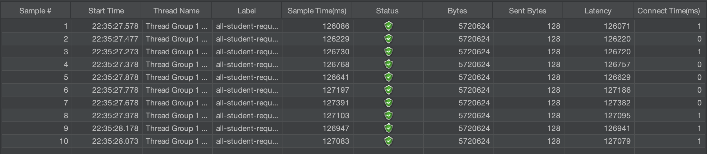
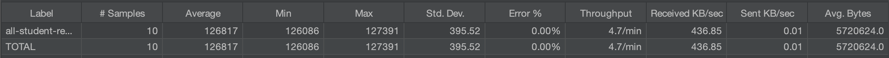
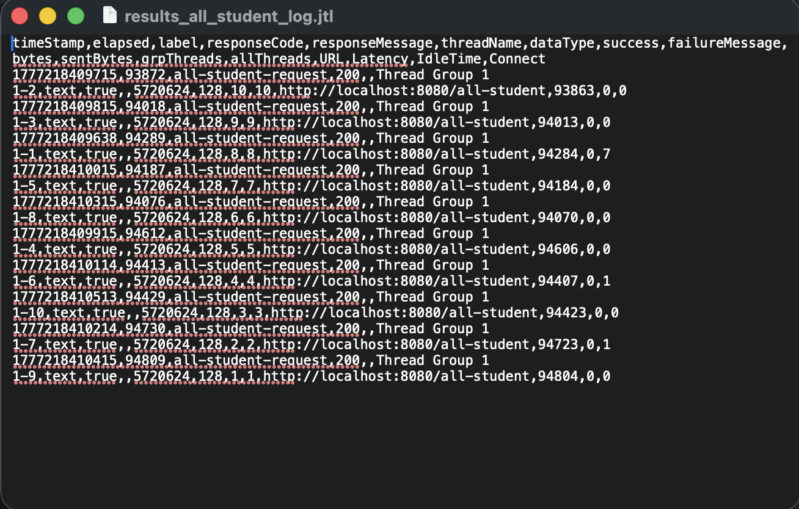
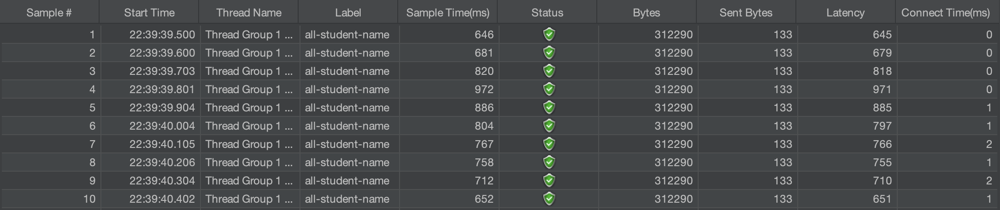
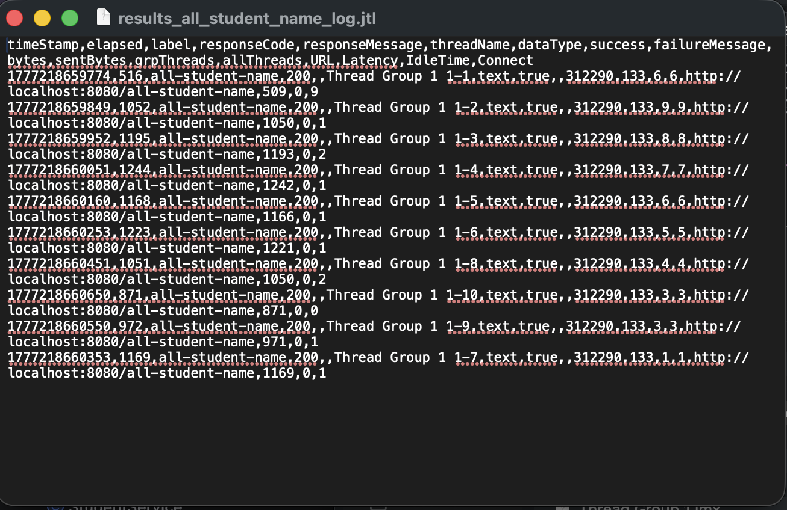
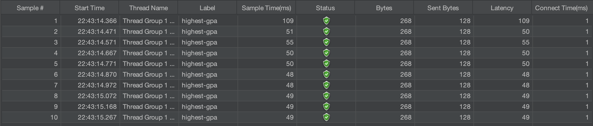
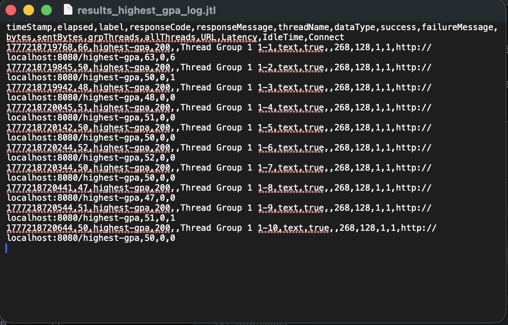

# Reflection

1. Perbedaan antara Performance Testing (JMeter) dan Profiling (IntelliJ Profiler)

Performance Testing dengan JMeter bersifat black-box testing. Fokus utamanya adalah mengukur perilaku aplikasi dari sudut pandang pengguna eksternal, seperti mengukur response time, throughput, dan error rate di bawah beban tertentu. Sementara itu, Profiling dengan IntelliJ Profiler bersifat white-box testing. Fokusnya adalah melihat ke dalam JVM untuk menganalisis eksekusi kode secara detail, mengidentifikasi method mana yang paling banyak memakan CPU atau memori, serta melacak penggunaan resource di tingkat baris kode.

2. Bagaimana Profiling Membantu Mengidentifikasi Titik Lemah (Weak Points)?

Profiling menyediakan visualisasi seperti Flame Graph dan Method List. Melalui Flame Graph, kita bisa melihat stack trace secara visual di mana kotak yang paling lebar menunjukkan method yang memakan waktu eksekusi paling lama. Dalam kasus ini, profiling menunjukkan bahwa getAllStudentsWithCourses memicu ribuan query Hibernate (N+1 Problem), yang secara langsung memberitahu saya bahwa titik lemahnya ada pada interaksi database yang tidak efisien, bukan pada logika bisnis di Java.

3. Apakah IntelliJ Profiler Efektif dalam Menganalisis Bottleneck?

Sangat efektif. Integrasi langsung di dalam IDE memudahkan siklus fix-and-test. Kemampuan profiler untuk memisahkan antara CPU Time (waktu proses aktif) dan Wall Time (waktu total termasuk menunggu I/O) sangat membantu saya menyadari bahwa bottleneck aplikasi ini bukan karena algoritma yang kompleks, melainkan karena latensi menunggu respon database yang berulang-ulang.

4. Tantangan Utama saat Melakukan Performance Testing dan Profiling

Tantangan utamanya adalah konsistensi data. Hasil pengukuran bisa dipengaruhi oleh aplikasi lain yang berjalan di latar belakang MacBook atau kondisi Cold Start pada JVM. Saya mengatasi tantangan ini dengan melakukan warm-up (mengakses endpoint beberapa kali sebelum pengukuran) dan memastikan kondisi lingkungan pengujian stabil (menutup aplikasi berat lain) agar data yang didapat benar-benar merepresentasikan performa kode.

5. Manfaat Utama menggunakan IntelliJ Profiler

Manfaat utamanya adalah presisi dan visualisasi. Saya tidak perlu menebak-nebak bagian mana yang lambat. Dengan fitur drill-down ke baris kode spesifik, saya bisa langsung mengetahui bahwa result += student.getName() dalam sebuah loop adalah penyebab pemborosan memori, dan N+1 query adalah penyebab latensi tinggi.

6. Menangani Ketidakkonsistenan antara JMeter dan Profiler

Jika JMeter menunjukkan respon yang lambat namun Profiler menunjukkan penggunaan CPU yang rendah, hal itu biasanya mengindikasikan masalah di luar kode aplikasi, seperti latensi jaringan, locking pada database, atau masalah pada connection pool. Strategi saya adalah memeriksa log database (seperti mengaktifkan show-sql) untuk melihat apakah jumlah query yang dikirimkan sesuai dengan ekspektasi.

7. Strategi Optimasi setelah Analisis

Strategi yang saya terapkan meliputi:

Eager Loading: Menggunakan JOIN FETCH di repository untuk menyelesaikan masalah N+1 Query.

Database Offloading: Memindahkan logika sorting dan filtering (seperti mencari GPA tertinggi) ke sisi database menggunakan SQL ORDER BY dan LIMIT.

String Efficiency: Mengganti penggabungan string manual dalam loop dengan String.join atau StringBuilder.

Verification: Untuk memastikan perubahan tidak merusak fungsionalitas, saya menjalankan unit test dan memastikan semua endpoint tetap mengembalikan data yang benar (validasi output) sebelum melakukan pengukuran performa akhir.

## Screenshot of endpoint /all-student-request

1. via Jmeter

    a. View Results in Table: 
    b. Summary Report: 

2. via CLI: 

## Screenshot of endpoint /all-student-name

1. via Jmeter

    a. View Results in Table: 
    b. Summary Report: 

2. via CLI: 

## Screenshot of endpoint /highest-gpa

1. via Jmeter

   a. View Results in Table: 
   b. Summary Report: 

2. via CLI: 
